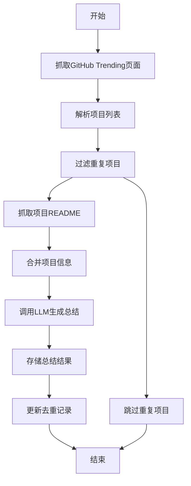

# GitHub Trending抓取和总结功能设计

**日期**: 2026-02-13
**状态**: 已批准
**作者**: Claude Code
**相关需求**: 实现一个类似sum_hackernews.py的功能，抓取GitHub Trending页面并总结项目

## 1. 概述

### 1.1 项目背景
`chat_with_llm`项目是一个Python CLI工具库，用于自动化内容消费和信息处理。现有功能包括HackerNews摘要、YouTube视频总结、新闻联播摘要等。用户需要新增GitHub Trending页面的抓取和总结功能。

### 1.2 目标
- 自动抓取GitHub Trending页面（`https://github.com/trending`）上的热门项目
- 为每个项目抓取README内容进行详细分析
- 使用LLM生成项目总结，突出技术特点和实用价值
- 实现重复检测机制，避免重复处理相同项目
- 支持代理访问GitHub，解决访问限制问题
- 每天自动运行一次，生成每日GitHub热门项目报告

## 2. 功能需求

### 2.1 核心功能
1. **Trending页面解析**
   - 抓取GitHub Trending页面HTML
   - 解析项目列表（仓库名、作者、描述、编程语言、星标数）
   - 支持按编程语言筛选（可配置）
   - 支持按时间范围筛选（daily/weekly/monthly）

2. **项目详情抓取**
   - 访问每个项目的GitHub页面
   - 抓取README.md内容
   - 提取项目描述、主题标签、关键特性
   - 处理Markdown格式，提取纯文本内容

3. **LLM总结生成**
   - 合并Trending信息和README内容
   - 调用LLM生成结构化总结
   - 输出包含：项目用途、技术栈、亮点、适用场景
   - 支持可配置的提示词模板

4. **重复检测**
   - 基于项目仓库URL检测重复
   - 检查最近N次运行记录（默认4次）
   - 避免重复处理相同项目

5. **代理支持**
   - 通过LinkSeek服务使用代理访问GitHub
   - 支持配置代理设置
   - 处理GitHub访问限制和速率限制

### 2.2 非功能需求
1. **性能**: 处理10个项目应在15分钟内完成
2. **可靠性**: 支持错误恢复和重试机制
3. **可配置性**: 提供命令行参数和配置文件选项
4. **可维护性**: 遵循现有代码架构和编码规范
5. **可扩展性**: 支持未来添加其他代码托管平台

## 3. 架构设计

### 3.1 总体架构
```
sum_github_trending.py (主脚本)
├── Trending页面解析器
├── 项目详情抓取器（README）
├── 重复检测器（复用sum_hackernews.py逻辑）
├── LLM摘要生成器（复用llm.py）
└── 结果存储模块（复用storage.py）
```

### 3.2 数据流程


### 3.3 模块依赖
- **llm.py**: LLM模型管理和聊天接口
- **storage.py**: 文件存储和缓存管理
- **config.py**: 配置加载和环境变量管理
- **web/online_content.py**: 在线内容检索框架
- **web/c4ai.py**: LinkSeek爬虫服务客户端

## 4. 详细设计

### 4.1 文件结构
```
scripts/sum_github_trending.py      # 主脚本
chat_with_llm/web/github_trending.py # GitHub Trending专用检索器（可选）
```

### 4.2 命令行参数设计
```python
# 必需参数
-m, --model: 使用的LLM模型（默认'ds-chat'）
-p, --prompt: 提示词版本（默认'v1'）

# 筛选参数
-l, --language: 编程语言筛选（如'python','javascript'）
-s, --since: 时间范围（'daily','weekly','monthly'，默认'daily'）
--top_n: 处理前N个项目（默认10）
--min_stars: 最小星标数阈值

# 功能参数
-d, --dedup_n: 去重回溯次数（默认4）
--use_proxy: 强制使用代理
--rate_limit: 请求延迟（秒，默认2）
--max_retries: 最大重试次数（默认3）
```

### 4.3 页面解析逻辑
#### GitHub Trending页面结构
```html
<article class="Box-row">
  <h1 class="h3 lh-condensed">
    <a href="/{owner}/{repo}">{owner}/{repo}</a>
  </h1>
  <p class="col-9 color-fg-muted my-1 pr-4">{description}</p>
  <div class="f6 color-fg-muted mt-2">
    <span class="d-inline-block ml-0 mr-3">{language}</span>
    <a href="/{owner}/{repo}/stargazers">{stars} stars</a>
    <span class="d-inline-block float-sm-right">{stars_today} stars today</span>
  </div>
</article>
```

#### 项目信息提取
```python
project_info = {
    "url": f"https://github.com/{owner}/{repo}",
    "owner": owner,
    "repo": repo,
    "full_name": f"{owner}/{repo}",
    "description": description,
    "language": language,
    "stars": stars,
    "stars_today": stars_today,
    "readme_content": None  # 后续填充
}
```

### 4.4 README抓取策略
1. **URL构建**: `https://github.com/{owner}/{repo}/blob/main/README.md`
2. **备用URL**: `https://github.com/{owner}/{repo}/blob/master/README.md`
3. **内容提取**: 使用LinkSeek服务抓取和清理HTML
4. **Markdown处理**: 转换Markdown为纯文本，保留代码片段
5. **缓存机制**: 本地缓存README内容，减少重复请求

### 4.5 重复检测实现
复用`sum_hackernews.py`的去重逻辑：
```python
# 使用场景标识
use_case = "sum_github_trending"

# 获取存储对象
chat_history_storage = llm.get_storage(use_case)

# 检查最近N次运行记录
files = chat_history_storage.list()
files = list(filter(lambda x: x.endswith('.input.txt'), files))
files.sort(reverse=True)

recent = files[:min(args.dedup_n, len(files))]
processed_urls = set()

for f in recent:
    content = chat_history_storage.load(f)
    # 提取已处理的URL（每行一个项目URL）
    processed_urls.update(content.split('\n'))

# 过滤已处理的项目
new_projects = [p for p in projects if p['url'] not in processed_urls]
```

### 4.6 LLM提示词设计
**提示词v1（默认）**:
```
你是一个技术分析师，需要总结GitHub热门项目。

项目信息：
- 仓库：{full_name}
- 描述：{description}
- 编程语言：{language}
- 星标数：{stars}（今日新增：{stars_today}）
- README内容：{readme_content}

请生成中文总结，包含以下部分：
1. 项目用途和核心功能（100-150字）
2. 技术栈和架构特点（80-100字）
3. 关键特性和创新点（80-100字）
4. 学习价值和应用场景建议（80-100字）
5. 与其他类似项目的对比（可选）

输出格式：
## {full_name}

**项目链接**: {url}

[总结内容]

---
```

### 4.7 错误处理策略
1. **网络错误**: 重试机制（最多3次），指数退避
2. **GitHub限制**: 代理切换，请求延迟
3. **README缺失**: 回退到项目描述
4. **LLM失败**: 记录错误，继续处理其他项目
5. **解析失败**: 使用更宽松的正则表达式，记录警告

### 4.8 存储设计
#### 文件命名
```
# 总结文件
{timestamp}_{model}_summary.txt

# 输入文件（用于去重）
{timestamp}_{model}_summary.input.txt
```

#### 内容格式
**.input.txt文件**:
```
https://github.com/owner1/repo1
https://github.com/owner2/repo2
...
```

**.txt文件**:
```
# GitHub Trending总结 {date}

## owner1/repo1
[总结内容]

---

## owner2/repo2
[总结内容]

---
```

## 5. 配置和部署

### 5.1 配置文件更新
在`config.yaml`中新增：
```yaml
GITHUB_TRENDING:
  USE_PROXY: true  # 默认使用代理
  MAX_PROJECTS: 10  # 每次处理的最大项目数
  DEFAULT_LANGUAGE: "python"  # 默认编程语言
  DEFAULT_SINCE: "daily"  # 默认时间范围
  RATE_LIMIT_DELAY: 2  # 请求延迟（秒）
  MAX_RETRIES: 3  # 最大重试次数
```

### 5.2 环境变量支持
```bash
export GITHUB_TRENDING_USE_PROXY="true"
export GITHUB_TRENDING_MAX_PROJECTS="10"
export GITHUB_TRENDING_DEFAULT_LANGUAGE="python"
```

### 5.3 调度配置
#### Cron示例（每天上午9点运行）
```bash
# 编辑crontab
crontab -e

# 添加以下行
0 9 * * * cd /home/huan/workspace/chat_with_llm && python scripts/sum_github_trending.py
```

#### Systemd Timer示例
```ini
# /etc/systemd/system/sum-github-trending.timer
[Unit]
Description=Daily GitHub Trending Summary

[Timer]
OnCalendar=daily
Persistent=true

[Install]
WantedBy=timers.target

# /etc/systemd/system/sum-github-trending.service
[Unit]
Description=GitHub Trending Summary Service

[Service]
Type=oneshot
User=huan
WorkingDirectory=/home/huan/workspace/chat_with_llm
ExecStart=/usr/bin/python scripts/sum_github_trending.py
```

## 6. 测试计划

### 6.1 单元测试
1. **页面解析测试**: 验证GitHub Trending HTML解析正确性
2. **URL构建测试**: 验证README URL构建逻辑
3. **去重逻辑测试**: 验证重复检测算法
4. **错误处理测试**: 验证网络错误和解析错误的处理

### 6.2 集成测试
1. **端到端测试**: 完整运行流程测试
2. **代理测试**: 验证代理功能正常工作
3. **LLM集成测试**: 验证LLM调用和响应处理
4. **存储测试**: 验证结果正确存储和读取

### 6.3 性能测试
1. **响应时间**: 单次运行应在15分钟内完成
2. **内存使用**: 不应超过500MB
3. **并发处理**: 验证并发抓取的稳定性
4. **错误恢复**: 验证部分失败时的恢复能力

### 6.4 验收标准
1. ✓ 正确抓取GitHub Trending页面项目
2. ✓ 成功抓取项目README内容
3. ✓ 生成有意义的LLM总结
4. ✓ 有效避免重复处理
5. ✓ 支持代理访问GitHub
6. ✓ 每日自动运行稳定

## 7. 实施时间线

### 阶段1：基础功能（第1周）
- [ ] 创建`sum_github_trending.py`脚本框架
- [ ] 实现Trending页面解析器
- [ ] 实现基础LLM总结（无README）
- [ ] 实现重复检测机制
- [ ] 基础测试和调试

### 阶段2：增强功能（第2周）
- [ ] 实现README抓取功能
- [ ] 优化LLM提示词
- [ ] 实现代理支持
- [ ] 添加错误处理和重试机制
- [ ] 完善配置选项

### 阶段3：优化和部署（第3周）
- [ ] 性能优化和缓存策略
- [ ] 添加日志和监控
- [ ] 创建调度配置
- [ ] 文档编写
- [ ] 最终测试和验证

## 8. 风险和缓解

### 8.1 技术风险
1. **GitHub访问限制**
   - 缓解：使用LinkSeek代理服务，实现请求速率控制

2. **HTML结构变化**
   - 缓解：使用健壮的解析逻辑，定期更新选择器

3. **LLM输出不一致**
   - 缓解：设计结构化提示词，添加输出验证

### 8.2 运维风险
1. **代理服务不可用**
   - 缓解：添加备用代理选项，实现故障转移

2. **存储空间不足**
   - 缓解：添加存储清理策略，定期归档旧数据

3. **网络不稳定**
   - 缓解：实现指数退避重试机制

## 9. 未来扩展

### 9.1 功能扩展
1. **多平台支持**: GitLab Trending, Gitee Trending
2. **深度分析**: 代码质量分析、依赖关系分析
3. **个性化推荐**: 基于用户兴趣的项目过滤
4. **通知集成**: Slack/Telegram/Discord自动推送

### 9.2 技术优化
1. **分布式抓取**: 提高抓取效率和稳定性
2. **机器学习分类**: 自动分类项目类型
3. **趋势分析**: 识别技术趋势和热点
4. **API优化**: 使用GitHub官方API提高可靠性

---

**批准记录**:
- [x] 设计已由用户审阅和批准
- [x] 设计文档已创建
- [ ] 实现计划已制定
- [ ] 代码实现完成
- [ ] 测试验证通过

**下一步**: 调用`writing-plans`技能创建详细实现计划。